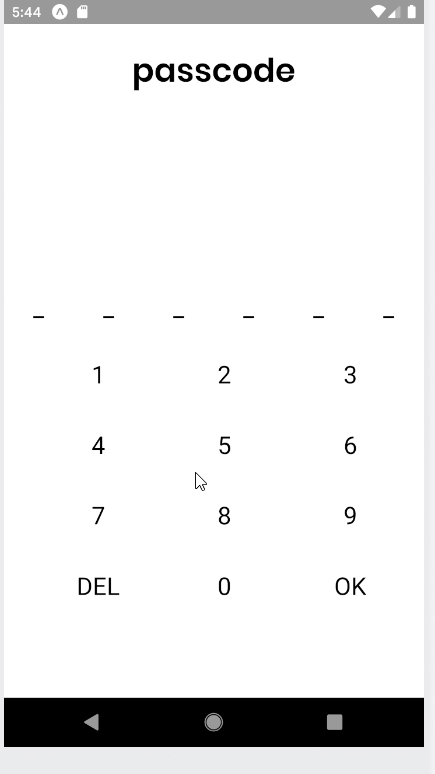
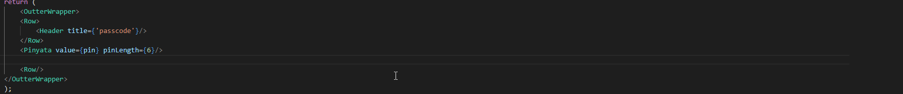

# react-native-passcode-pad

Allows for sexy passcode key pad

Which allows for: <br/>

 <br/>

Treat it like a ```<TextInput/>``` component <br/>

import the dependency: ``` import Paddle from 'react-native-passcode-pad```

use it

 <br/>

hook into the  ```<TextInput/>``` like events: <br/>

## Accepts the following props

``` value``` The value.... <br/>

``` onChangeText ``` returns the value ....of the component (you'll get log warnings if this is not used)<br/>
``` onSubmitEditing ``` returns the value when the user hits ok (you'll get log warnings if this is not used) <br/>

``` numberElement ``` a function (hopefully react-native?) that is called instead of the default numbers<br/>

**note** numberElement functions are called with the following arguments (so you can style each number however you like): <br/>

``` 	return numberElement(numberInput, onPress, props);```

```numberInput``` is the number that should (or shouldn't) be displayed
```onPress``` is what ```paddle``` listens to when a child component is... pressed (it expects to be provided the 'value' of the thing that was pressed... Typically a number).

```props``` the remaining props, if any

This component is **just the keypad** part of the gif example above. Pinyata is coming soon <br/>

